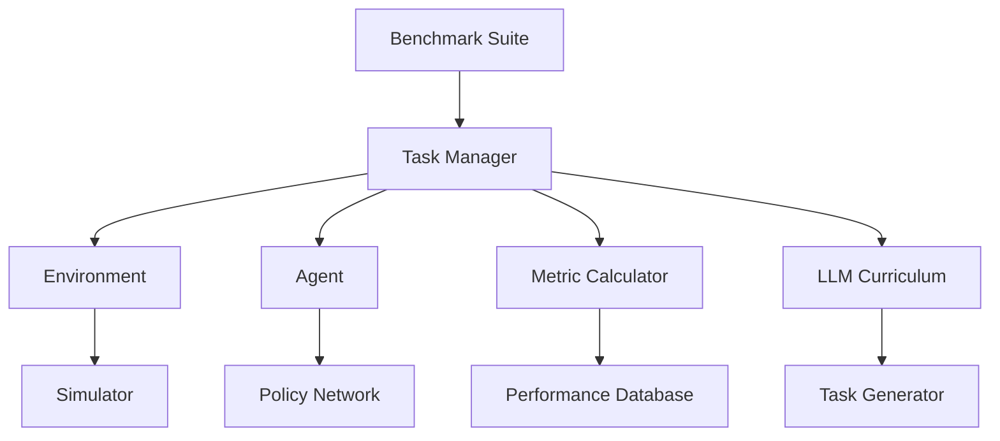

# Architecture Overview

## System Design

Embodied-AI Benchmark++ is designed as a modular, extensible framework for evaluating embodied AI systems across multiple simulators and task domains.

### Core Components

```
embodied_ai_benchmark/
├── core/                  # Core abstractions and interfaces
│   ├── base_task.py      # Task interface
│   ├── base_env.py       # Environment interface
│   ├── base_agent.py     # Agent interface
│   └── base_metric.py    # Metric interface
├── tasks/                # Task implementations
│   ├── manipulation/     # Object manipulation tasks
│   ├── navigation/       # Navigation tasks
│   ├── multiagent/       # Multi-agent cooperative tasks
│   └── language/         # Language-guided tasks
├── simulators/           # Simulator integrations
│   ├── habitat/          # Habitat integration
│   ├── maniskill/        # ManiSkill integration
│   └── isaac/            # Isaac Sim integration
├── metrics/              # Evaluation metrics
│   ├── success.py        # Task success metrics
│   ├── efficiency.py     # Performance efficiency
│   ├── safety.py         # Safety metrics
│   └── collaboration.py  # Multi-agent metrics
├── curriculum/           # LLM-guided curriculum
│   ├── llm_curriculum.py # Adaptive task generation
│   └── difficulty.py     # Difficulty progression
└── evaluation/           # Benchmarking infrastructure
    ├── benchmark_suite.py
    ├── evaluator.py
    └── reporter.py
```

### Data Flow

1. **Task Creation**: Tasks are defined using the `BaseTask` interface
2. **Environment Setup**: Simulators implement the `BaseEnv` interface
3. **Agent Interaction**: Agents follow the `BaseAgent` protocol
4. **Metric Computation**: Metrics are calculated using `BaseMetric` implementations
5. **Curriculum Adaptation**: LLM analyzes performance and adjusts difficulty

### Communication Architecture



### Multi-Agent Coordination

- **Communication Protocol**: Structured message passing with bandwidth limits
- **Role Assignment**: Dynamic role allocation based on task requirements
- **Coordination Primitives**: Synchronization, resource sharing, conflict resolution

### Extensibility Points

1. **Custom Tasks**: Implement `BaseTask` for new scenarios
2. **Custom Metrics**: Extend `BaseMetric` for domain-specific evaluation
3. **Custom Simulators**: Implement `BaseEnv` for new simulation platforms
4. **Custom Agents**: Follow `BaseAgent` interface for integration

### Performance Considerations

- **Vectorized Operations**: Use NumPy/PyTorch for efficient computation
- **Parallel Evaluation**: Multi-process task execution
- **Memory Management**: Efficient observation/action buffering
- **GPU Acceleration**: CUDA support for neural network inference

### Security & Safety

- **Input Validation**: All user inputs are validated and sanitized
- **Resource Limits**: Memory and compute limits to prevent resource exhaustion
- **Safe Actions**: Action bounds checking to prevent simulator crashes
- **Error Handling**: Graceful degradation on simulator failures